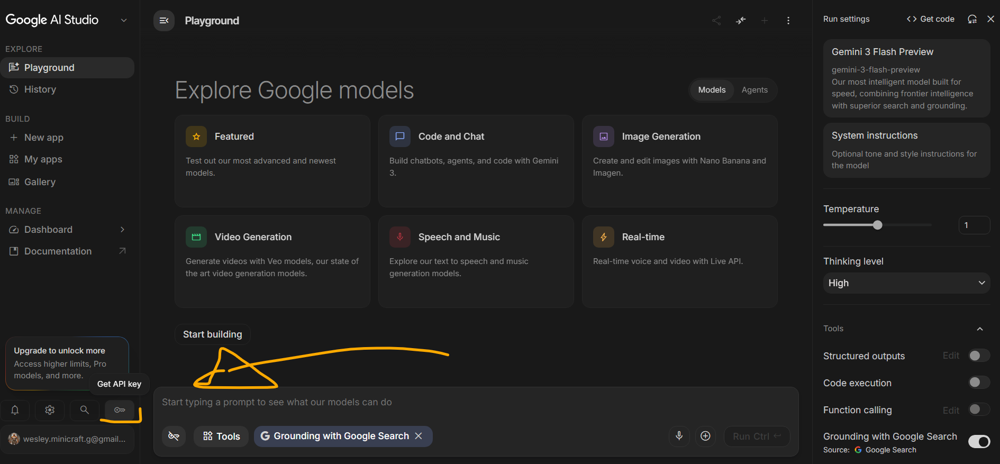
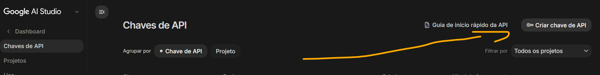
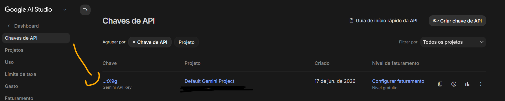
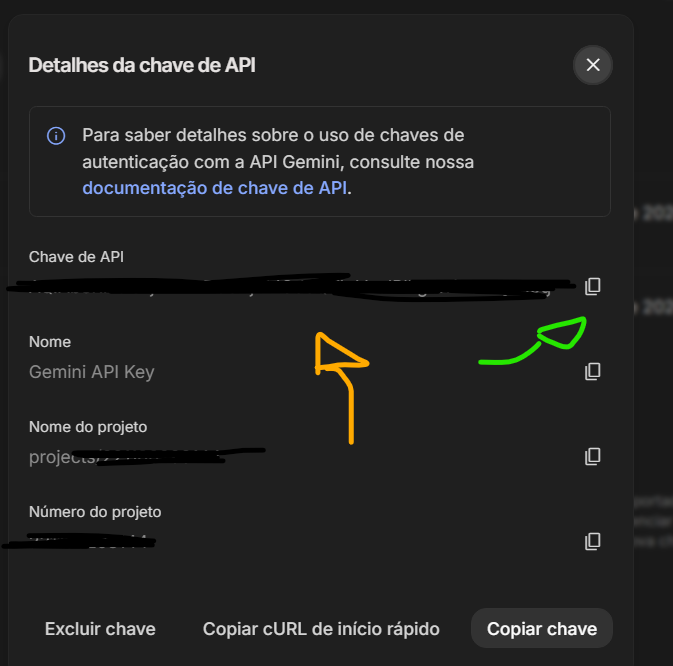
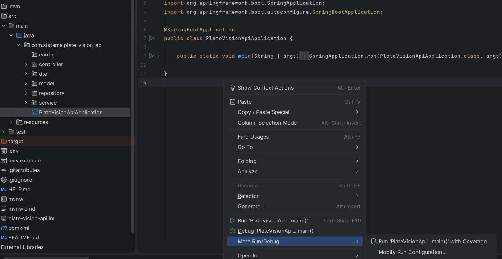
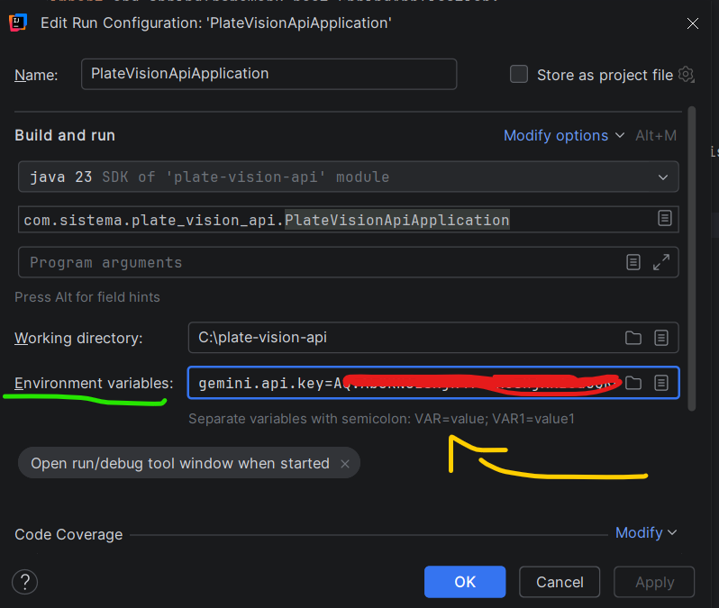

# 📸 Plate Vision API — Sistema Inteligente de Monitoramento de Veículos e Controle de Acessos

[](https://spring.io/projects/spring-boot)
[](https://openjdk.org/)
[](https://ai.google.dev/)
[](https://www.h2database.com/)

O **Plate Vision API** é um ecossistema completo de backend desenvolvido para a disciplina de Engenharia de Computação da **SATC**. O sistema resolve o problema de automação de portarias, estacionamentos e centros logísticos ao integrar inteligência artificial para o processamento de imagens em tempo real.

A aplicação recebe uma imagem capturada por qualquer dispositivo móvel, utiliza o modelo **Google Gemini 2.5 Flash** para extrair os caracteres da placa automobilística, higieniza o texto por meio de algoritmos de tratamento de OCR e consulta instantaneamente a base de dados relacional. Com base nas regras de negócio pré-estabelecidas, o sistema determina se o veículo possui acesso regularizado ou bloqueado, registrando o evento em uma tabela auditável de acessos históricos com paginação e suporte a exportações em formato de planilha.

---

## 📌 Sumário
1. [🏗️ Estrutura Arquitetural de Pastas e Arquivos](#️-estrutura-arquitetural-de-pastas-e-arquivos)
2. [🎯 Mapeamento de Requisitos do Trabalho Acadêmico](#-mapeamento-de-requisitos-do-trabalho-acadêmico)
3. [🔑 Como Configurar a API Key após Clonar o Repositório](#-como-configurar-a-api-key-após-clonar-o-repositório)
4. [🗺️ Documentação Detalhada das Rotas (Endpoints)](#️-documentação-detalhada-das-rotas-endpoints)
   * [Proprietários](#-proprietários)
   * [Veículos](#-veículos)
   * [Leitura de Placas (IA)](#-leitura-de-placas-ia)
   * [Histórico e Auditoria de Acesso](#-histórico-e-auditoria-de-acesso)
5. [🔍 Como Realizar Pesquisas Avançadas (Filtros)](#-como-realizar-pesquisas-avançadas-filtros)
6. [🛑 Guia de Teste de Erros HTTP (Respostas Semânticas)](#-guia-de-teste-de-erros-http-respostas-semânticas)


---

## 🏗️ Estrutura Arquitetural de Pastas e Arquivos

O projeto adota o padrão de arquitetura em camadas (Layered Architecture), separando as responsabilidades de entrada, validação, inteligência operacional e persistência de dados.

```text
plate_vision_api/
├── src/
│   └── main/
│       ├── java/
│       │   └── com/
│       │       └── sistema/
│       │           └── plate_vision_api/
│       │               ├── PlateVisionApiApplication.java    # Classe de Inicialização do Spring Boot
│       │               │
│       │               ├── controller/                       # Camada de Controle (Exposição dos Endpoints HTTP)
│       │               │   ├── PlacaController.java            # Endpoint de Upload da foto e processamento IA
│       │               │   ├── ProprietarioController.java     # Endpoint do CRUD de Proprietários
│       │               │   ├── RegistroAcessoController.java   # Endpoint de Logs e Exportação de CSV
│       │               │   └── VeiculoController.java          # Endpoint do CRUD de Veículos
│       │               │
│       │               ├── dto/                              # Camada de Transferência de Dados e Validação (Bean Validation)
│       │               │   ├── ProprietarioDTO.java            # Valida nome, CPF e formato de telefone
│       │               │   ├── RegistroAcessoDTO.java          # Mapeia logs de entrada
│       │               │   └── VeiculoDTO.java                 # Garante consistência de placas e chaves estrangeiras
│       │               │
│       │               ├── model/                            # Camada de Modelo (Entidades de Banco de Dados/JPA)
│       │               │   ├── Proprietario.java               # Entidade da tabela de pessoas (1)
│       │               │   ├── RegistroAcesso.java             # Entidade da tabela de logs de auditoria
│       │               │   └── Veiculo.java                    # Entidade da tabela de automóveis (N)
│       │               │
│       │               ├── repository/                       # Camada de Acesso a Dados (Spring Data JPA)
│       │               │   ├── ProprietarioRepository.java     # Queries de Proprietário (Busca por CPF/Nome)
│       │               │   ├── RegistroAcessoRepository.java   # Queries de Log (Ordenações cronológicas)
│       │               │   └── VeiculoRepository.java          # Queries de Veículo (Busca por Placa única)
│       │               │
│       │               └── service/                          # Camada de Serviço (Regras de Negócio e APIs externas)
│       │                   ├── PlacaService.java               # Integração com o Google Gemini e correções ortográficas
│       │                   ├── ProprietarioService.java        # Regras de negócio de cadastro de pessoas
│       │                   ├── RegistroAcessoService.java      # Processamento de fluxo e conversão de dados para CSV
│       │                   └── VeiculoService.java             # Validação de placas e amarração de chaves estrangeiras
│       │
│       └── resources/
│           ├── application.properties                        # Parâmetros estruturais do Spring, JPA e H2 Database
│           └── static/
│               └── index.html                                # Painel Web Mobile integrado para testes em tempo real
├── .env.example                                              # Arquivo modelo para configuração de chaves locais
├── .gitignore                                                # Exclusão de arquivos de IDE e chaves confidenciais
├── pom.xml                                                   # Arquivo de gerenciamento de dependências Maven
└── README.md                                                 # Documentação oficial do projeto (Este arquivo)

```

---

## 📋 Requisitos do Edital Atendidos

O projeto foi rigorosamente estruturado de forma a cumprir 100% das exigências de avaliação técnica da disciplina:

| Requisito do Edital | Implementação no Projeto | Arquivo / Origem Base |
| :--- | :--- | :--- |
| **Serviço Backend HTTP** | API REST estruturada em Spring Boot a rodar nativamente na porta `8080`. | `pom.xml` / Classe Application |
| **Arquitetura em Camadas** | Divisão explícita de responsabilidades em pacotes isolados de Controladores, Serviços e Repositórios. | Estrutura de Pastas do Projeto |
| **Persistência de Dados** | Mapeamento de tabelas físicas e relacionamentos através do Hibernate/JPA. | `application.properties` |
| **Pelo menos 3 Entidades** | Modelagem completa de regras de negócio através de: `Proprietario`, `Veiculo` e `RegistroAcesso`. | Pacote `model/` |
| **Relação entre Entidades** | Vínculo relacional de 1:N (Um Proprietário pode possuir múltiplos Veículos cadastrados). | `Proprietario.java` (`@OneToMany`) |
| **Métodos CRUD Completos**| Operações completas de Criação, Consulta (Individual/Geral), Atualização e Remoção. | Controladores e Serviços |
| **Paginação e Ordenação** | Listagem de registos otimizada utilizando `@PageableDefault` e retorno estruturado em objetos `Page<T>`. | Controladores de Listagem |
| **Filtros de Busca** | Pesquisas textuais por aproximação de caracteres (LIKE) ignorando maiúsculas/minúsculas (Ignore-Case). | `ProprietarioRepository.java` |
| **Utilização de DTOs** | Isolamento da camada de transporte de dados de entrada/saída, protegendo as entidades físicas do banco. | Pacote `dto/` |
| **Validação de Dados** | Uso de anotações como `@Valid`, `@NotBlank` e `@Size` para garantir a integridade antes da persistência. | Camada de DTOs e Controllers |
| **Códigos HTTP Semânticos**| Respostas estruturadas seguindo o padrão REST (ex: `201 Created`, `204 No Content`, `404 Not Found`). | Camada de Controladores |
| **Carta-Desafio** | Exportação de dados de auditoria em tempo real gerando arquivos físicos no formato CSV. | `RegistroAcessoController.java` |

---
## 🚀 Como Executar a Aplicação

### 1. Pré-requisitos
- Ter o **Java 17** ou superior instalado. (Projeto feito em Java 23 jdk)
- Ter o **Maven** configurado (ou utilizar o wrapper `./mvnw`).

### 2. Configuração e Execução do Backend
 Clone o repositório para a sua máquina local.

Execute o projeto através da sua IDE de preferência (IntelliJ IDEA, VS Code) ou via terminal com o comando:
   
   `mvn spring-boot:run`


## Configurar a Chave da API do Gemini (API Key)
O projeto utiliza uma variável de ambiente para não expor chaves de segurança no código.
`PEGAR UMA KEY GRATIS :`  https://aistudio.google.com


-

-

-


No diretório raiz do projeto, altere o nome do arquivo`.env.example ` PARA ->
`.env` dentro dele coloque sua chave key que você resgatou, certifique-se de não ter aspas (''ou') e nem Espaço , e baixe os Plugins se solicitar,
então coloque isso:
` 
gemini.api.key=suaChaveKEY`
# Caso não Rodar o projeto PlateVisionApiApplication
selecione `PlateVisionApiApplication`, com botão direito do Mause dentro do Testo em um local vazio, vá até esse caminho.



More run Debug >
`Modify Run Configuration`

-Então cole sua key igual na foto como está no `.env` Aplicar e pronto.


---
## Fluxo de Funcionamento do Sistema

O fluxo de dados da aplicação segue o seguinte percurso síncrono:
1. **Frontend (Telemóvel/PC):** O operador tira uma foto à placa do veículo e clica em "Processar".
2. **Controller (`MultipartFile`):** A imagem é recebida via HTTP POST no servidor Spring Boot.
3. **Service (Integração IA):** O servidor envia o arquivo de imagem para o componente que comunica com o Google Gemini.
4. **AI Engine (OCR):** A Inteligência Artificial faz a leitura visual, extrai os caracteres da placa e devolve o texto para o Spring Boot.
5. **Regras de Negócio (Repository):** O sistema pesquisa na base de dados se a placa está cadastrada e ativa.
6. **Persistência & Resposta:** Um registo de acesso imutável é guardado na tabela de histórico, e o veredito (Liberado/Bloqueado) é enviado de volta para atualizar o ecrã do utilizador.

---
## 🗄Modelo de Dados (Estrutura das Tabelas)

O sistema baseia-se em três entidades principais fortemente ligadas:

- **Proprietário (`Proprietario`):** Guarda os dados do utilizador responsável (`id`, `nome`, `cpf`, `telefone`, `statusAtivo`).
- **Veículo (`Veiculo`):** Contém os dados do automóvel autorizado (`id`, `placa`, `modelo`, `cor`, `proprietario_id`). Possui uma relação `@ManyToOne` com o Proprietário.
- **Registo de Acesso (`RegistroAcesso`):** Funciona como a tabela de auditoria do sistema (`id`, `placaDetectada`, `dataHoraAcesso`, `statusAcesso`, `justificativa`).
---

## 🗺️ Documentação Detalhada das Rotas (Endpoints)

A API trabalha estritamente com os padrões RESTful, utilizando os métodos HTTP corretos para cada operação e retornando objetos estruturados (JSON) ou arquivos físicos quando necessário.

### 1. Proprietários (`/proprietarios`)
Gerencia o cadastro das pessoas vinculadas aos veículos do sistema.
- `GET /proprietarios` -> Retorna a lista paginada e ordenada de todos os proprietários cadastrados.
- `GET /proprietarios/{id}` -> Busca os detalhes de um proprietário específico pelo ID. Retorna `404` se não existir.
  - `POST /proprietarios` -> Cria um novo proprietário. Requer um DTO de entrada validado. Retorna `201 Created`.

    ```
    URL: http://localhost:8080/proprietarios
     Método: POST
     {
      "nome": "Wesley Machado",
      "cpf": "123.456.789-00",
      "telefone": "(48) 99999-8888"
      }

- A. Criar Pessoa (Proprietário)
JSON (Body):
- ```
  URL: http://localhost:8080/veiculos

   Método: POST

   JSON
   {
   "placa": "BEE4R22",
   "modelo": "Honda Civic LXS",
   "cor": "Cinza",
   "status": "REGULAR",
   "proprietarioId": 1
   }
- `PUT /proprietarios/{id}` -> Atualiza os dados de um proprietário existente com base no ID.
- ````
  URL: http://localhost:8080/proprietarios/1  (Atualiza a pessoa de ID 1)

   Método: PUT

   JSON
   { 
   "nome": "Wesley Machado",
   "cpf": "123.456.789-00",
   "telefone": "(48) 98888-5555"
   }
  
 ---
Atualizar Carro (Ex: Placa clonada/Bloqueada)
    ```
   URL: http://localhost:8080/veiculos/1 
(Atualiza o veículo de ID 1)
   
   Método: PUT

      JSON
      {
      "placa": "BEE4R22",
      "modelo": "Honda Civic LXS",
      "cor": "Cinza",
      "status": "BLOQUEADO",
      "proprietarioId": 1
      }

---


`DELETE /proprietarios/{id}` -> Remove um proprietário do banco de dados. Retorna `204 No Content`.

--DELETAR CARROS 
-> `http://localhost:8080/veiculos/1`


   

###  2. Veículos (`/veiculos`)
Gerencia os automóveis e motocicletas que possuem autorização de acesso.
- `GET /veiculos` -> Lista todos os veículos de forma paginada.
- `GET /veiculos/{id}` -> Consulta um veículo específico por ID.
- `POST /veiculos` -> Vincula um novo veículo ao sistema (associando-o ao ID de um proprietário existente).
- `PUT /veiculos/{id}` -> Atualiza placas, modelos ou cores do veículo.
- `DELETE /veiculos/{id}` -> Remove o veículo do sistema.

###  3. Leitura de Placas via IA (`/placas`)
Ponto central de integração com a inteligência artificial para automação de portaria.
- `POST /placas/upload` -> Rota do tipo `multipart/form-data` que recebe o arquivo físico da imagem (parâmetro `foto`). A imagem é enviada para a API do Google Gemini, que faz o OCR (reconhecimento do texto da placa). Em seguida, o sistema valida se a placa pertence a um veículo cadastrado e gera o veredito de acesso.

###  4. Histórico e Auditoria de Acesso (`/acessos`)
Registra de forma imutável todas as tentativas de entrada no estabelecimento.
- `GET /acessos?page=0&size=10&sort=id,desc` -> Lista as últimas leituras processadas, estruturada para paginação nativa do Spring Data JPA.
- `GET /acessos/export` -> **[Carta-Desafio]** Endpoint que gera dinamicamente e força o download de um arquivo físico no formato `.csv` contendo o relatório completo de auditoria para controle gerencial.

---

## 🔍 Como Realizar Pesquisas Avançadas (Filtros)

Para cumprir a exigência de buscas textuais inteligentes por aproximação, implementamos filtros dinâmicos na camada de repositório utilizando palavras-chave do Spring Data (`ContainingIgnoreCase`).

### Como testar os filtros:
Você pode passar parâmetros de busca diretamente na URL (Query Parameters).

**Exemplo de Busca por Nome de Proprietário:**
Se você quiser buscar todos os proprietários que tenham "Wesley" no nome, independentemente de estar em maiúsculo ou minúsculo, use a rota:

`GET http://localhost:8080/proprietarios/busca?nome=wesley`
---
Guia de Teste de Erros HTTP (Respostas Semânticas)
O sistema foi blindado para responder com os códigos de status HTTP corretos. Veja abaixo como testar cada validação:

1. Erro de Validação (400 Bad Request)
   Como testar: Tente fazer um POST /proprietarios enviando o campo nome em branco ou um CPF com formato inválido.

O que acontece: As anotações @Valid, @NotBlank e @Size disparam uma exceção interceptada pelo Spring, devolvendo o status 400 com a lista exata dos campos que falharam na validação.

2. Recurso Não Encontrado (404 Not Found)
   Como testar: Tente buscar ou deletar um proprietário ou veículo com um ID que sabidamente não existe no banco (ex: GET /proprietarios/9999).

O que acontece: O sistema lança uma resposta limpa com status 404, indicando ao frontend que aquele registro não foi localizado.

3. Sucesso sem Conteúdo (204 No Content)
   Como testar: Realize a exclusão com sucesso de qualquer registro existente utilizando o método DELETE.

O que acontece: A API responde com o status 204, confirmando que a operação foi concluída no banco e que não há dados adicionais para retornar no corpo da resposta.

---
## 📱 Funcionalidades da Interface Web/Mobile (`index.html`)

A aplicação localizada na pasta `src/main/resources/static/`, oferecendo os seguintes recursos:

1. **Captura Híbrida Inteligente:** Botões dedicados e otimizados para dispositivos móveis. O botão **Tirar Foto** aciona diretamente a câmara traseira do smartphone (`capture="environment"`), enquanto o botão **Usar Galeria** permite o upload de arquivos de imagem locais.
2. **Processamento Assíncrono com Feedback Visual:** Exibe um carregador animado enquanto a IA processa a placa. O resultado exibe um card dinâmico: **Verde (Liberado)** ou **Vermelho (Bloqueado)** com a justificativa das regras de negócio.
3. **Sincronização Simultânea em Tempo Real (Polling):** A tabela de últimos acessos faz varreduras automáticas a cada 3 segundos no banco de dados. Qualquer veículo processado por um computador atualizará instantaneamente o ecrã do telemóvel do operador (e vice-versa), sem necessidade de recarregar a página.
4. **Respeito Dinâmico ao IP do Servidor:** O frontend auto-configura as rotas através de `window.location.origin`, permitindo que o computador e múltiplos smartphones na mesma rede Wi-Fi operem o sistema sem erros de conexão ou travamento em `localhost`.
5. 

https://github.com/user-attachments/assets/85d85a63-a807-415c-95ee-a2fb48356aee


